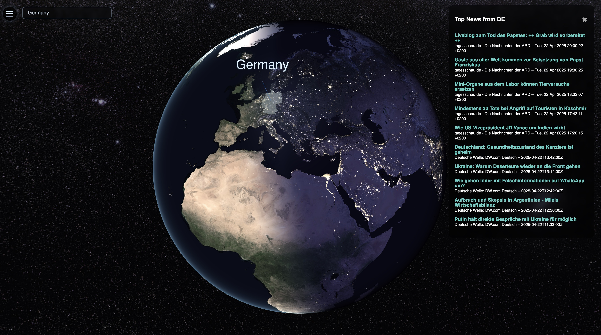
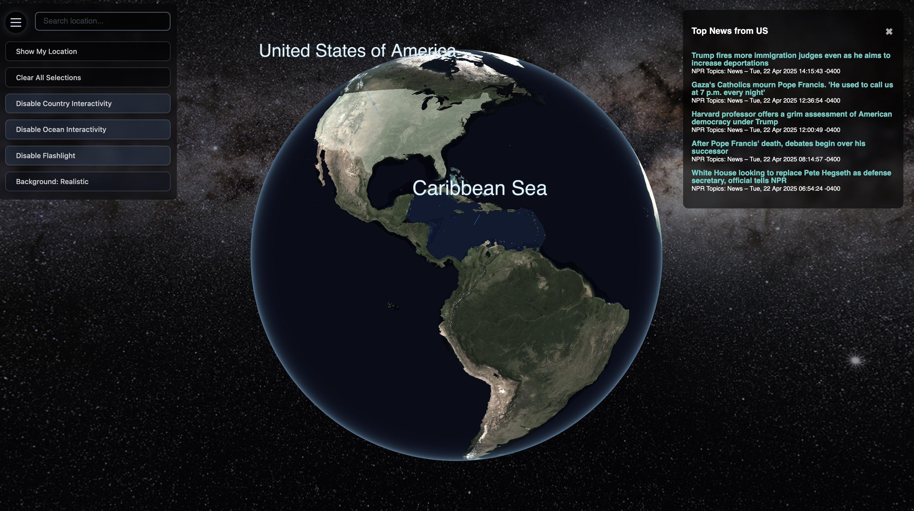

# 🌍 OrbitalOne

<p align="center">
  
  
</p>

**Orbitalone** is a real-time 3D Earth visualization app powered by **TypeScript**, **Three.js**, and custom **GLSL shaders**. It blends beauty and function to deliver intuitive, extensible Earth-based data visualizations — including country borders, ocean overlays, news integration, and more. The project is under active development. Beware of bugs and incomplete features! PR's or Issues welcome.

🚀 Live at: [https://orbitalone.space](https://orbitalone.space)

---

> 🛰️ **Orbit Alone**  
> We live on a rock, floating through a silent universe that offers no inherent meaning, no guarantees, and no rescue.  
> Borders, ideologies, histories — from space, they vanish. What’s left is one fragile system, alive by chance and sustained by collaboration.

> 🌍 **Orbital One**  
> To orbit alone is to realize we are all in the same orbit.  
> One species. One biosphere. One chance to make something of it.  
> If nothing has meaning by default, then everything we choose to care for becomes meaningful — together.

**Orbitalone** is a tool for global awareness.  
It visualizes the planet’s political and environmental complexity,  
not to emphasize division, but to clarify the stakes:  
Only by seeing the whole can we navigate the parts.  
Only by embracing our smallness can we act with purpose.

---

## ✨ Features

- 🧭 Interactive 3D globe with clickable country and ocean regions  
- 🌞 Real-time Earth rotation, lighting, and day/night cycle via custom shaders  
- 🌐 Country + ocean search bar (instantly zoom to any place on Earth)  
- 📰 Daily news articles shown when selecting a country  
- 📍 Geolocation marker using the browser’s location API  
- 🎨 Smooth hover and selection transitions with animated 3D labels  
- ⚙️ Modular TypeScript architecture, shader-driven materials, and centralized config

---

## 🛠 Installation

```bash
git clone https://github.com/frogfromlake/Orbitalone.git
cd Orbitalone/frontend
pnpm install      # or npm install
pnpm dev          # start dev server (http://localhost:5173/)
```

### 🮾 Backend (Go) Setup

The backend serves country-specific news via RSS. It lives in `/backend` and must be started separately.

```bash
cd Orbitalone/backend

# Install Go dependencies
go mod tidy

# Run locally
go run main.go

# Or build binary
go build -o orbitalone-news .
./orbitalone-news
```

---

## 🧩 Project Structure

```
frontend/
├── configs/        # Central app configuration
├── core/           # App bootstrap logic
├── data/           # Centroids, borders, ID maps
├── features/       # Feature modules like news panel
├── init/           # Scene, camera, textures, uniforms
├── interactions/   # User input, search, interactivity
├── materials/      # Shader materials
├── shaders/        # GLSL files
├── state/          # Interaction state store
├── systems/        # Hover, selection, label systems
├── types/          # Custom TS types and extensions
└── utils/          # Geo helpers, math, conversions
```

---

## 🧪 Config-Driven Design

All app behavior is configurable via `src/configs/config.ts`.

```ts
export const CONFIG = {
  globe: { radius: 1, widthSegments: 128, heightSegments: 64 },
  camera: { initialPosition: { z: 3 }, ... },
  fade: { highlight: 3.5, selection: 2.5 },
  textures: {
    day: "/textures/earth_day_8k.jpg",
    night: "/textures/earth_night_8k.jpg",
    idMap: "/textures/country_id_map_8k_rgb.png"
  },
  ...
};
```

---

## 🛰️ Under the Hood

- Uses **NASA Blue Marble** (day) and **Black Marble** (night) textures (8K)
- Pixel-perfect hover detection using **RGB-encoded country ID maps**
- Accurate floating labels via **geographic centroids**
- Custom shaders control **lighting**, **glow**, **night lights**, and **interactive outlines**

---

## 🌍 News Backend

The backend is written in **Go** and serves country-specific news via RSS.  
It's a separate service in `/backend`:

> `GET /api/news?country=DE` → returns JSON articles for Germany

See [Installation](#-installation) above for setup.

---

## 📦 Build

```bash
pnpm build      # builds production-ready app into /dist
```

Assets and textures live in `/public/textures`.

Frontend is deployed via [Vercel](https://vercel.com) and the backend is deployed using [Fly.io](https://fly.io).  
See: [https://orbitalone.space](https://orbitalone.space)

---

## 👨‍🚀 Author

Created with passion by Fabian Quist [@frogfromlake](https://github.com/frogfromlake)  
Made for explorers, thinkers, dreamers — and for Earth.

---

## 🪐 License: **MIT**

## ❕ Deployment Policy

This project is open source for **learning, exploration, and extension** — but:

> **Please do not deploy this project under the same name (`Orbitalone`) or branding.**  
> The live instance at [https://orbitalone.space](https://orbitalone.space) is the official deployment.

Feel free to:
- Fork the repo
- Run it locally or privately
- Build upon it for your own unique project

But **do not redeploy** it as a clone with the same identity or public URL.  
If you're unsure, [open an issue](https://github.com/frogfromlake/Orbitalone/issues) or reach out!
