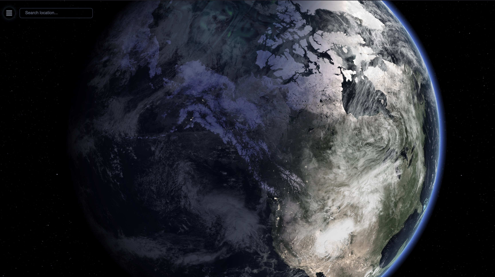
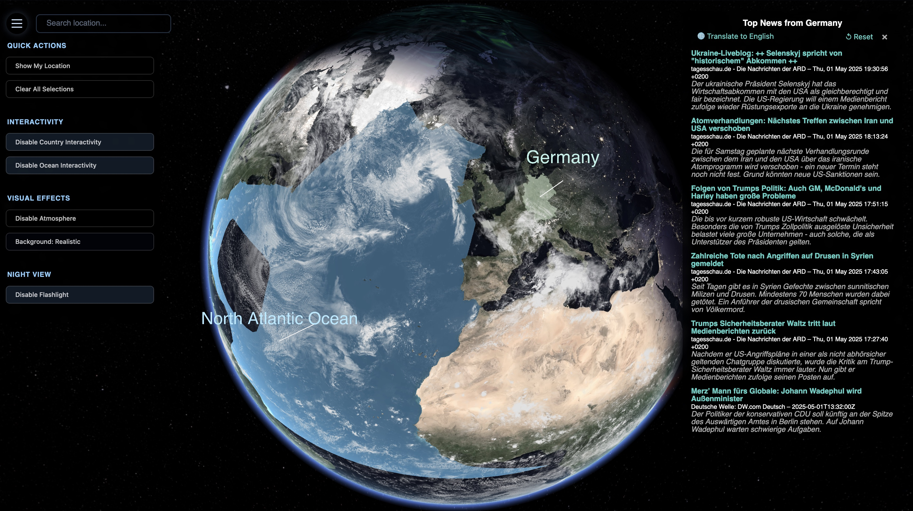

# 🌍 OrbitalOne

<p align="center">
  
  
</p>

**OrbitalOne** is a real-time 3D Earth visualization app powered by **TypeScript**, **Three.js**, and custom **GLSL shaders**. It blends beauty and function to deliver intuitive, extensible Earth-based data visualizations — including country borders, ocean overlays, live news, and more.

⚠️ Heads up: This project is in early Alpha. Some features may break, glitch, or vanish mysteriously. It's also not fully optimized or responsive yet—expect occasional chaos.

Live at: [https://orbitalone.space](https://orbitalone.space)

---

## 🌐 Vision

**OrbitalOne** is a tool for global awareness.  
It visualizes the planet’s political and environmental complexity —  
not to emphasize division, but to clarify the stakes:  
Only by seeing the whole can we navigate the parts.  
Only by embracing our smallness can we act with purpose.

---

## 🛰️ Philosophy

> **Orbit Alone**  
> We live on a rock, floating through a silent universe that offers no inherent meaning, no guarantees, and no rescue.  
> Borders, ideologies, histories — from space, they vanish. What’s left is one fragile system, alive by chance and sustained by collaboration.

> **Orbital One**  
> To orbit alone is to realize we are all in the same orbit.  
> One species. One biosphere. One chance to make something of it.  
> If nothing has meaning by default, then everything we choose to care for becomes meaningful — together.

---

## Features

- Interactive 3D globe with clickable country and ocean regions  
- Real-time Earth rotation, lighting, and day/night shaders  
- Floating 3D labels + connector lines for hover and selection  
- Search any country or ocean to jump directly to it  
- Show your current location via geolocation marker  
- Translated daily news articles when selecting a country  
- Language toggle for original vs. translated text  
- DeepL-powered backend with smart caching to reduce API usage  
- Admin panel for managing and testing country RSS feeds  
- Clean, modular TypeScript architecture with centralized config  
- Fade transitions, label scaling, and dynamic lighting effects

---

### Textures

- Earth Day: [June Blue Marble (NASA)](https://visibleearth.nasa.gov/images/76487/june-blue-marble-next-generation)
- Earth Night: [Earth at Night - Black Marble 2016](https://www.visibleearth.nasa.gov/images/144898/earth-at-night-black-marble-2016-color-maps)
- Earth Clouds: [Blue Marble Clouds](https://visibleearth.nasa.gov/images/57747/blue-marble-clouds/57749l)
- Earth Topography: [Earth Topography (NASA)](https://visibleearth.nasa.gov/images/73934/topography/84331l)

---

## Installation

```bash
git clone https://github.com/frogfromlake/Orbitalone.git
cd Orbitalone/frontend
pnpm install      # or npm install
pnpm dev          # start dev server (http://localhost:5173/)
```

### Backend (Go) Setup

The backend serves country-specific news (with DeepL translation + caching) and runs separately:

```bash
cd Orbitalone/backend

# Install Go dependencies
go mod tidy

# Create a local .env file:
echo "DEEPL_API_KEY=your-key-here" > .env

# Run locally
go run main.go
```

The backend also supports a lightweight admin panel (for feed management) when run in non-production mode.

---

## News Translation + Caching

- News is fetched via curated **country-level RSS feeds**
- Translations are powered by **DeepL** (free tier) with:
  - Language detection from ISO-3166 codes
  - Session-persistent user toggle (original vs. translated)
  - Caching layer to reduce quota usage
  - Skips translation for English-language content

Admin panel available at `/#admin` (in dev) lets you:
- View current feed mappings
- Test RSS URLs
- Add or remove feeds for any country

> All translations are cached for 24 hours using `patrickmn/go-cache`.

---

## Backend API

```http
GET /api/news?country=JP
```

Returns:

```json
[
  {
    "title": "Translated title (if enabled)",
    "originalTitle": "原文タイトル",
    "link": "https://...",
    "description": "...",
    "originalDescription": "...",
    "source": "NHK Japan",
    "published": "2025-04-25T08:00:00Z"
  }
]
```

---

## 👨‍🚀 Author

Created with passion by Fabian Quist [@frogfromlake](https://github.com/frogfromlake)  
Made for explorers, thinkers, dreamers — and for Earth.

---

## License

This project is **proprietary** — not open source.

The source code is provided for **viewing and learning only**.  
Please see [LICENSE.txt](./LICENSE.txt) for full terms.

If you're interested in licensing, commercial use, or collaboration, contact:  
📩 **nelix@posteo.de**

---

OrbitalOne is a quiet call to look at Earth differently.  
To zoom out — not to detach, but to care more deeply.  
Thanks for visiting 🌍
