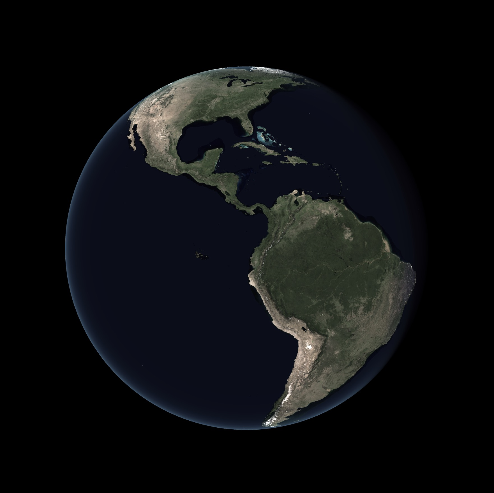

# 🌍 Globe

<p align="center">
  
  
</p>

**Globe** is a real-time 3D Earth visualization app built with **TypeScript** and **Three.js**, featuring dynamic country highlighting, smooth interactions, real-world lighting, and modular, configurable architecture. Custom **GLSL shaders** drive realistic visuals like day/night cycles and glow effects.  
Designed for clarity and extensibility—ideal as a foundation for educational, geopolitical, or scientific visualizations.

## Features

- Interactive 3D globe with real country borders
- Dynamic lighting and real-time Earth rotation using custom shaders
- Country hover + multi-select with smooth fade transitions
- Geolocation marker support using the browser's location API
- Clean architecture with centralized configuration (`config.ts`)
- Fully modular TypeScript codebase

## Installation

```bash
git clone https://github.com/frogfromlake/Globe.git
cd Globe
pnpm install    # or npm install
pnpm dev        # or npm run dev
```

This runs a local development server (typically on `http://localhost:5173/` if using Vite).

## Configuration

All core behavior is defined in one central file:  
**`src/configs/config.ts`**

Inside, you can configure:

- `globe`: Geometry resolution and radius
- `camera`: FOV, clipping planes, and initial position
- `interaction`: Speed clamps for rotation/zoom
- `fade`: Hover and selection transition speeds
- `userLocation`: Geolocation marker appearance
- `materials`: Shader material settings and appearance
- `geo`: Astronomy and geographic constants (e.g., J2000, obliquity)
- `textures`: Paths and filtering for globe maps and ID maps

Every value is documented inline for clarity and maintainability.

## Project Structure

```
src/
├── configs/          # Central configuration
├── data/             # Country centroids & ID maps
├── init/             # Scene/camera/renderer setup
├── interactions/     # User input and geolocation
├── shaders/          # GLSL shader files (vertex & fragment)
├── systems/          # Country hover, labels, selection logic
├── types/            # TypeScript types/interfaces
└── utils/            # Geospatial math and helpers
```

## Development Notes

- Uses NASA’s **Blue Marble Next Generation** and **Black Marble** (night) textures at 8K resolution.
- Utilizes **RGB-encoded country ID maps** generated from a GeoJSON file (`countries.json`) for pixel-perfect country selection.
- Includes a centroid lookup table (`countryCenters.ts`) generated from `countries.json` for accurate label placement.
- Custom data generation scripts live in `src/data`:
  - `generateRgbMap.ts` for the country ID texture
  - `generateCountryCenters.ts` for geographic centroids
- You can replace the base maps with custom textures, provided the projection matches or is adjusted accordingly.
- Built with **Three.js v0.175+**, **TypeScript**, **GLSL**, and **pnpm**.

## Author

Created by [@frogfromlake](https://github.com/frogfromlake)

## License

MIT — free to use, modify, and share.
